# Data Flow and Trace Format

This document describes how telemetry data moves from Tokio runtime hooks through thread-local buffers, into rotating trace files on disk, and optionally up to S3. A separate section covers the binary trace format itself.

```mermaid
---
title: "dial9-tokio-telemetry: Data Flow"
---
graph LR
    %% ── Main horizontal spine ──────────────────────────────
    Workers["🔧 <b>Tokio Workers</b><br/>N threads, each with<br/>TL Buffer ≤1 MB"]
    Collector["📦 <b>CentralCollector</b><br/>ArrayQueue (1024 slots)<br/>force_push eviction"]
    Flush["⏱ <b>dial9-flush</b><br/>5 ms tick"]
    Writer["💾 <b>RotatingWriter</b><br/>trace.N.bin.active"]
    BgWorker["⚙️ <b>dial9-worker</b><br/>1 s poll"]
    Output(["📤 <b>Output</b>"])

    Workers -- "Batch<br/>(~1 MB)" --> Collector
    Collector --> Flush
    Flush -- "write bytes" --> Writer
    Writer -- "sealed .bin" --> BgWorker
    BgWorker --> Output

    %% ── Hooks feed in from top ─────────────────────────────
    subgraph Hooks["Runtime Hooks"]
        direction LR
        HP["PollStart/End"]
        HW["Park/Unpark"]
        HT["TaskSpawn/Term"]
        HK["WakeEvent<br/>(handle.spawn)"]
    end
    Hooks --> Workers

    %% ── Encoding detail from bottom ────────────────────────
    subgraph Encode["Per-Event Encoding (~100–200 ns)"]
        direction LR
        EA["Atomic check"]
        EB["Schema + StringPool<br/>(1st use)"]
        EC["u24 Δt + varint fields"]
        ED["Flush if ≥1 MB<br/>or epoch stale"]
        EA --> EB --> EC --> ED
    end
    Workers -.-> Encode

    %% ── Flush details from bottom ──────────────────────────
    subgraph DrainProto["Drain Protocol"]
        direction LR
        D1["Tick N: bump epoch"]
        D2["Tick N+1: drain idle TLBs"]
        D1 --> D2
    end
    Flush -.-> DrainProto

    %% ── Rotation detail from top ───────────────────────────
    subgraph Rotation["Segment Lifecycle"]
        direction LR
        R1[".active → .bin<br/>(seal)"]
        R2["Time: 60 s wall-aligned<br/>Size: safety valve"]
        R3["Evict oldest<br/>over disk budget"]
        R1 --- R2 --- R3
    end
    Rotation -.-> Writer

    %% ── Pipeline stages from bottom ────────────────────────
    subgraph Pipeline["Background Pipeline"]
        direction LR
        P1["Symbolize<br/>(Linux)"]
        P2["Gzip"]
        P1 --> P2
    end
    BgWorker -.-> Pipeline

    %% ── Output branches from top ───────────────────────────
    S3["☁️ <b>S3 Upload</b><br/>{prefix}/{date}/{HH}/{svc}/…<br/>circuit breaker: 1 s → 5 min"]
    Local["📁 <b>Local .bin.gz</b><br/>writeback + delete original"]
    Output --> S3
    Output --> Local

    %% ── Format reference from bottom ───────────────────────
    subgraph Format["Binary Trace Format"]
        direction LR
        FH["TRC\\0 v1"]
        FM["SegmentMeta"]
        FC["ClockSync"]
        FF["Schema 0x01 · Event 0x02<br/>StringPool 0x03 · TsReset 0x05"]
        FH --- FM --- FC --- FF
    end
    Format -.-> Writer

    %% ── Styling ────────────────────────────────────────────
    classDef spine fill:#2d5986,stroke:#1a3a5c,color:#fff,font-weight:bold
    classDef detail fill:#f5f5f5,stroke:#999,color:#333
    classDef output fill:#c96b3c,stroke:#a04f28,color:#fff

    class Workers,Collector,Flush,Writer,BgWorker spine
    class Output output
    class S3,Local output
```



## System Overview

```
┌─────────────────────────────────────────────────────────────────────────┐
│  Tokio Runtime (instrumented via hooks)                                 │
│                                                                         │
│  ┌──────────┐  ┌──────────┐  ┌──────────┐  ┌──────────┐               │
│  │ Worker 0  │  │ Worker 1  │  │ Worker 2  │  │ Worker 3  │  ...        │
│  │           │  │           │  │           │  │           │              │
│  │ TL Buffer │  │ TL Buffer │  │ TL Buffer │  │ TL Buffer │             │
│  │ (≤1 MB)   │  │ (≤1 MB)   │  │ (≤1 MB)   │  │ (≤1 MB)   │            │
│  └─────┬─────┘  └─────┬─────┘  └─────┬─────┘  └─────┬─────┘            │
│        │  self-flush   │              │              │                   │
│        │  or intrusive │              │              │                   │
│        │  drain        │              │              │                   │
└────────┼───────────────┼──────────────┼──────────────┼───────────────────┘
         │               │              │              │
         ▼               ▼              ▼              ▼
    ┌──────────────────────────────────────────────────────┐
    │         CentralCollector (lock-free ArrayQueue)       │
    │         capacity: 1024 batches (~1 GB max)            │
    │         eviction: force-push drops oldest             │
    └──────────────────────────┬────────────────────────────┘
                               │
                               ▼
    ┌──────────────────────────────────────────────────────┐
    │         dial9-flush thread (5 ms tick)                │
    │                                                       │
    │  • Drains collector → EventWriter                     │
    │  • Coordinates TL buffer drains (epoch protocol)      │
    │  • Samples global queue depth (every 10 ms)           │
    │  • Drains CPU profiler samples (Linux)                │
    └──────────────────────────┬────────────────────────────┘
                               │
                               ▼
    ┌──────────────────────────────────────────────────────┐
    │         RotatingWriter                                │
    │                                                       │
    │  • Writes to trace.{N}.bin.active                     │
    │  • Time-based rotation (default 60s, wall-aligned)    │
    │  • Size-based rotation (safety valve)                 │
    │  • Seals: rename .active → .bin                       │
    │  • Evicts oldest files when over disk budget          │
    └──────────────────────────┬────────────────────────────┘
                               │ sealed .bin files
                               ▼
    ┌──────────────────────────────────────────────────────┐
    │         dial9-worker thread (1s poll interval)        │
    │                                                       │
    │  Pipeline:                                            │
    │  ┌─────────────┐  ┌──────┐  ┌──────────────────────┐ │
    │  │ Symbolize*  ├─►│ Gzip ├─►│ S3Upload / WriteBack │ │
    │  └─────────────┘  └──────┘  └──────────────────────┘ │
    │  * Linux + cpu-profiling feature only                 │
    └──────────────────────────────────────────────────────┘
```

## Hook Installation

`TracedRuntime` (or `TelemetryCore` for multi-runtime setups) registers callbacks on `tokio::runtime::Builder` before building the runtime. These hooks fire on every worker thread:

| Hook | Event recorded |
|------|---------------|
| `on_before_task_poll` | `PollStart` — worker ID, task ID, spawn location, local queue depth |
| `on_after_task_poll` | `PollEnd` — worker ID |
| `on_thread_park` | `WorkerPark` — worker ID, local queue depth, thread CPU time |
| `on_thread_unpark` | `WorkerUnpark` — worker ID, local queue depth, thread CPU time, sched wait |
| `on_task_spawn` | `TaskSpawn` — task ID, spawn location (requires `task_tracking`) |
| `on_task_terminate` | `TaskTerminate` — task ID (requires `task_tracking`) |
| `on_thread_start` | Installs `TelemetryHandle` in thread-local storage; registers thread for CPU profiling |
| `on_thread_stop` | Clears handle; unregisters thread |

Worker IDs are resolved lazily on the first park/poll event via `tokio::runtime::worker_index()`, then cached in thread-local storage. In multi-runtime setups, each runtime reserves a contiguous block of IDs from a global atomic counter, so worker IDs are unique across runtimes.

Wake events (`WakeEvent`) are not captured by hooks — Tokio does not expose a waker hook. Instead, `TelemetryHandle::spawn()` wraps the future in a `Traced<F>` adapter that installs a custom waker. When something wakes the future, the custom waker records a `WakeEvent` (waker task ID, woken task ID, target worker) before forwarding to the real waker.

## Thread-Local Encoding

Each Tokio worker thread has its own `ThreadLocalBuffer` stored in a `thread_local!` as `Arc<Mutex<ThreadLocalBuffer>>`. The `Arc` lets the flush thread hold a `Weak` reference for cross-thread draining. The `Mutex` is rarely contended — the owning thread holds it briefly during encoding, and the flush thread only locks truly idle buffers.

Inside the buffer, a `dial9_trace_format::Encoder<Vec<u8>>` encodes events directly into a growable byte vector. The encoding path for a single event:

1. Hook fires, constructs a `RawEvent` enum variant (e.g., `RawEvent::PollStart { ... }`)
2. `SharedState::record_event()` checks the `enabled` atomic flag (Relaxed load)
3. `buffer::record_encodable_event()` accesses the thread-local `BUFFER`, locks the mutex
4. `Encodable::encode()` writes the event into the `Encoder`:
   - Schema auto-registered on first use (one Schema frame per event type per buffer lifetime)
   - String fields (spawn locations) interned via `intern_string()` → emits String Pool frame on first occurrence, 4-byte pool ID on subsequent uses
   - Timestamp delta-encoded as u24 (3 bytes); Timestamp Reset frame emitted when delta exceeds 16.7 ms
   - Numeric fields use LEB128 varints (worker IDs, task IDs) or fixed-width (queue depths as u8)
5. `event_count` incremented
6. Flush check: if `encoder.bytes_written() >= 1,023 KB` OR `flush_epoch < drain_epoch`:
   - `encoder.reset_to()` swaps out the encoded bytes, returns them as a `Batch`
   - `collector.accept_flush(batch)` pushes into the lock-free queue
   - Fresh `Vec` allocated with `batch_size + 1 KB` headroom

On thread exit, `ThreadLocalBuffer::Drop` flushes any remaining events. If no collector was registered (thread never recorded an event), a rate-limited warning is logged.

Typical per-event cost: ~100–200 ns (encode + conditional flush check).

## Central Collector

The `CentralCollector` is a `crossbeam::ArrayQueue<Batch>` with capacity 1024. Multiple worker threads push concurrently without locks.

```
Worker 0 ──► ┌─────────────────────────────────────┐ ──► flush thread
Worker 1 ──► │  ArrayQueue<Batch>  (cap: 1024)      │     drains via
Worker 2 ──► │  force_push: evicts oldest on overflow│     collector.next()
Worker 3 ──► └─────────────────────────────────────┘
```

- `accept_flush(batch)` uses `force_push` — if the queue is full, the oldest batch is silently dropped and a counter incremented. This makes the queue a ring buffer that preserves the most recent data under backpressure.
- `next()` pops the oldest batch (FIFO). Called by the flush thread in a tight loop.
- With ~1 MB batches and 1024 slots, the queue can buffer roughly 1 GB before eviction kicks in. In practice, the flush thread drains it every 5 ms, so occupancy stays low.

## Flush Thread and Drain Protocol

The `dial9-flush` thread is the single consumer of the `CentralCollector`. It runs a 5 ms tick loop:

```
every 5 ms:
  ├─ check for shutdown command
  ├─ if disabled: skip
  ├─ sample global queue depth (every 10 ms)
  ├─ drain coordination state machine
  ├─ drain CPU profiler (Linux)
  ├─ while collector.next() → write batch to EventWriter
  └─ flush writer to disk
```

The drain coordination uses a two-tick protocol to flush thread-local buffers without contending with busy workers:

```
                    Tick N-1                          Tick N
                    ────────                          ──────
Flush thread:       bump drain_epoch                  lock + drain idle TLBs
                         │                                 │
Busy workers:       see epoch advance on next         already self-flushed;
                    record_event → self-flush          flush thread skips them
                         │                                 │
Idle workers:       (no events, don't notice)         flush thread locks their
                                                      buffer and drains it
```

The state machine has two states:
- `Idle` → writer says `should_drain()` → bump epoch, transition to `EpochBumped`
- `EpochBumped` → intrusive drain of all TL buffers, call `writer.drained()`, back to `Idle`

`RotatingWriter::should_drain()` returns true when `has_real_events && now >= next_drain_time`. The drain interval defaults to `min(rotation_period, 30s)`. After draining, `drained()` checks whether a rotation boundary has also been crossed and rotates if so.

On shutdown, both steps happen in a single tick: bump epoch, drain all buffers, write final metadata, seal the segment.

## Segment Lifecycle

A segment is a single trace file. The `RotatingWriter` manages the lifecycle:

```
  create                    seal                     process
    │                        │                         │
    ▼                        ▼                         ▼
trace.0.bin.active  ──►  trace.0.bin  ──►  trace.0.bin.gz
    (writing)            (sealed)          (compressed / uploaded)
```

### File Naming

- Active (being written): `{stem}.{index}.bin.active`
- Sealed (rotation complete): `{stem}.{index}.bin`
- After background processing: `{stem}.{index}.bin.gz`

Index starts at 0 and increments monotonically. Each sealed segment is self-contained: it starts with a file header (`TRC\0` + version byte), a `SegmentMetadata` event (runtime name → worker ID mappings), and a `ClockSync` event (monotonic ↔ wall clock correlation).

### Rotation

Two triggers, checked independently:

**Time-based rotation** (preferred): Wall-clock-aligned boundaries. A 60-second period at 14:03:22 rotates at 14:04:00. Coordinated with the drain protocol — all thread-local buffers are flushed before sealing, so segments have clean time boundaries with minimal overlap.

**Size-based rotation** (safety valve): Fires immediately when `bytes_written > max_file_size`, without draining TL buffers first. Segments may overlap in time. Set `max_file_size` large enough (e.g. 100 MB) that time-based rotation fires first under normal conditions.

The rotation sequence:
1. Flush the active encoder to disk
2. Rename `.active` → `.bin` (seal)
3. Push sealed path + size to `closed_files` deque
4. Create new `.active` file at next index
5. Write header + metadata + ClockSync to new file
6. Run eviction

### Eviction

After each rotation, `evict_oldest()` removes sealed files oldest-first until `total_disk_usage <= max_total_size`. It scans the directory for files matching the original name (handles `.gz` variants from the background worker). If even the current active file alone exceeds the budget, the writer enters a terminal `Finished` state and stops writing.

### Finalize

On shutdown, `finalize()` seals the current segment if it contains real events, or deletes it if it only has header + metadata (empty segment after an idle period).

## Background Worker

The `dial9-worker` thread runs a processing pipeline over sealed segments. It starts when `trace_path` is configured and either CPU profiling or S3 upload is enabled.

```
  ┌─────────────────────────────────────────────────────────────┐
  │  Worker Loop (polls every 1s)                                │
  │                                                              │
  │  find_sealed_segments(dir, stem)                             │
  │       │                                                      │
  │       ▼  for each .bin file, sorted by index (oldest first)  │
  │  ┌─────────┐     ┌──────────┐     ┌────────────────────────┐│
  │  │Symbolize│────►│   Gzip   │────►│ S3Upload / WriteBack   ││
  │  │ (opt.)  │     │          │     │                        ││
  │  │ resolve │     │ flate2   │     │ S3: upload + delete    ││
  │  │ addrs → │     │ fast     │     │ Local: write .gz +     ││
  │  │ symbols │     │ compress │     │        delete .bin     ││
  │  └─────────┘     └──────────┘     └────────────────────────┘│
  └─────────────────────────────────────────────────────────────┘
```

### Pipeline Stages

Each stage implements `SegmentProcessor` and transforms a `SegmentData` (bytes + metadata) before passing it to the next stage:

**Symbolize** (Linux, `cpu-profiling` feature): Reads `/proc/self/maps` and uses blazesym to resolve raw stack frame addresses to function names. Appends symbol table entries to the segment bytes. Skips already-compressed segments.

**Gzip**: Compresses with `flate2` at `Compression::fast()`. Checks for gzip magic bytes to avoid double-compression. Sets `content_encoding: gzip` and `write_back_extension: .gz` in metadata.

**S3Upload** (`worker-s3` feature): Uploads via the AWS SDK transfer manager, then deletes the local file. Protected by a circuit breaker (see below). S3 object metadata includes service name, boot ID, segment index, and start time.

**WriteBack** (when S3 is not configured): Writes the compressed bytes to `{path}.gz`, then deletes the original `.bin`. If the original was already evicted by `RotatingWriter`, cleans up the `.gz` to prevent leaks.

### S3 Key Format

```
{prefix}/{YYYY-MM-DD}/{HHMM}/{service_name}/{instance_path}/{boot_id}/{epoch_secs}-{index}.bin.gz
```

The date/time bucket is the first key component after the optional prefix, enabling incident correlation: `aws s3 ls s3://bucket/traces/2026-03-07/2030/` lists all traces from all services during that minute. The `boot_id` (4 alpha chars + PID, regenerated per process start) disambiguates segments across restarts.

### Circuit Breaker

S3 uploads are guarded by a circuit breaker with two states:

- **Closed** (healthy): all uploads attempted
- **Open**: skip uploads until `next_retry` time, then probe

Backoff: 1s initial, doubles on repeated failures, caps at 5 minutes. Any success resets to Closed. `NotFound` errors (segment evicted by `RotatingWriter`) do not trip the breaker — only actual S3 connectivity failures do.

### Error Handling

- Segment read failure (file evicted): skip silently
- Processor failure (non-NotFound): delete the segment to prevent infinite retry, log warning
- S3 upload failure: circuit breaker opens, local file preserved
- All errors carry `SegmentData` back so metrics guards flush on drop

### Shutdown

`guard.graceful_shutdown(timeout)` sends the timeout to the worker, which does one final segment scan before exiting. Plain `Drop` of the guard does not wait for the worker to drain — segments remain on disk for the next process start or manual retrieval.

---

## Binary Trace Format

The format is defined in `dial9-trace-format`. It is a self-describing binary stream: schema frames declare event layouts, then event frames carry data whose structure the decoder resolves from the schema. This means the format can carry arbitrary event types (built-in and user-defined) without the decoder needing compile-time knowledge of every event.

### Stream Layout

```
┌────────┬───────┬───────┬───────┬─────┐
│ Header │ Frame │ Frame │ Frame │ ... │
│ 5 bytes│       │       │       │     │
└────────┴───────┴───────┴───────┴─────┘
```

**Header** (5 bytes):

| Offset | Size | Value |
|--------|------|-------|
| 0 | 4 | Magic: `TRC\0` (`0x54 0x52 0x43 0x00`) |
| 4 | 1 | Version: `0x01` |

### Frame Types

Each frame starts with a 1-byte tag. Unknown tags halt decoding (no way to skip without knowing frame size).

| Tag | Type | Purpose |
|-----|------|---------|
| `0x01` | Schema | Declares an event type's field layout |
| `0x02` | Event | Carries one event's data |
| `0x03` | String Pool | Defines interned strings referenced by PooledString fields |
| `0x05` | Timestamp Reset | Resets the running timestamp base |

### Schema Frame (`0x01`)

```
┌──────┬─────────┬──────────┬──────┬───────────────┬─────────────┬────────────────────┐
│ 0x01 │ type_id │ name_len │ name │ has_timestamp  │ field_count │ FieldDef × count   │
│ u8   │ u16 LE  │ u16 LE   │ UTF8 │ u8 (0 or 1)   │ u16 LE      │                    │
└──────┴─────────┴──────────┴──────┴───────────────┴─────────────┴────────────────────┘

FieldDef:
┌──────────┬──────┬────────────┐
│ name_len │ name │ field_type │
│ u16 LE   │ UTF8 │ u8         │
└──────────┴──────┴────────────┘
```

- `type_id` is a u16 assigned sequentially by the encoder. Stable only within a single file.
- `has_timestamp = 1` means events carry a packed u24 timestamp delta in their header. The timestamp field is not listed in `fields`.
- Re-registering the same `type_id` with an identical schema is allowed (idempotent).

### Event Frame (`0x02`)

Without timestamp:
```
┌──────┬─────────┬──────────────┐
│ 0x02 │ type_id │ field values  │
│ u8   │ u16 LE  │ (per schema) │
└──────┴─────────┴──────────────┘
```

With timestamp (`has_timestamp = 1`):
```
┌──────┬─────────┬───────────────────┬──────────────┐
│ 0x02 │ type_id │ timestamp_delta   │ field values  │
│ u8   │ u16 LE  │ u24 LE (3 bytes)  │ (per schema) │
└──────┴─────────┴───────────────────┴──────────────┘
```

The u24 delta encodes nanoseconds since the current timestamp base (0–16,777,215 ns ≈ 16.7 ms range). When the gap exceeds this, the encoder emits a Timestamp Reset frame first.

### Timestamp Delta Encoding

The encoder maintains a running `timestamp_base_ns`:

1. Compute `delta = event_ts - base`
2. If `delta > 16,777,215` or `event_ts < base`: emit Timestamp Reset frame, set `base = event_ts`, `delta = 0`
3. Write `delta` as 3-byte u24 LE in the event header
4. Advance: `base = event_ts`

The base advances after every timestamped event, so deltas represent inter-event gaps rather than offsets from a distant origin. This keeps values small and repetitive, which compresses well with gzip.

### String Pool Frame (`0x03`)

```
┌──────┬───────┬──────────────────────────────────────┐
│ 0x03 │ count │ PoolEntry × count                     │
│ u8   │ u32LE │                                       │
└──────┴───────┴──────────────────────────────────────┘

PoolEntry:
┌─────────┬──────────┬──────┐
│ pool_id │ data_len │ data │
│ u32 LE  │ u32 LE   │ UTF8 │
└─────────┴──────────┴──────┘
```

The encoder maintains a `HashMap<String, u32>` mapping string content to pool IDs. On first occurrence, a String Pool frame is emitted. Subsequent references use the 4-byte pool ID (PooledString field type). Used for spawn locations, thread names, and repeated string values in custom events.

### Timestamp Reset Frame (`0x05`)

```
┌──────┬──────────────┐
│ 0x05 │ timestamp_ns  │
│ u8   │ u64 LE        │
└──────┴──────────────┘
```

Total: 9 bytes. Sets `timestamp_base_ns` for subsequent event deltas.

### Field Types

| Tag | Name | Wire Encoding | Size |
|-----|------|---------------|------|
| 1 | I64 | 8-byte LE signed | 8 |
| 2 | F64 | 8-byte IEEE 754 LE | 8 |
| 3 | Bool | 1 byte | 1 |
| 4 | String | u32 length + UTF-8 | 4 + len |
| 5 | Bytes | u32 length + raw | 4 + len |
| 7 | PooledString | u32 pool ID | 4 |
| 8 | StackFrames | u32 count + count × u64 LE | 4 + 8n |
| 9 | Varint | Unsigned LEB128 | 1–10 |
| 10 | StringMap | u32 count + (key_len + key + val_len + val) × count | variable |
| 11 | U8 | 1 byte unsigned | 1 |
| 12 | U16 | 2-byte LE unsigned | 2 |
| 13 | U32 | 4-byte LE unsigned | 4 |

**Optional modifier** (`0x80`): The high bit marks a field as optional. Wire encoding: `0x00` = absent (1 byte total), `0x01` = present (followed by inner type). Example: tag `0x87` = optional PooledString.

**LEB128**: Each byte encodes 7 value bits; MSB is a continuation flag. A u64 takes at most 10 bytes. Values 0–127 fit in 1 byte.

### Built-in Event Types

All built-in events have `has_timestamp = 1`. The timestamp field is marked with `#[traceevent(timestamp)]` in the derive macro and packed into the event header as a u24 delta.

| Event | Fields (excluding timestamp) | Typical wire size |
|-------|------------------------------|-------------------|
| `PollStart` | worker_id (Varint), local_queue (U8), task_id (Varint), spawn_loc (PooledString) | ~12 bytes |
| `PollEnd` | worker_id (Varint) | ~6 bytes |
| `WorkerPark` | worker_id (Varint), local_queue (U8), cpu_time_ns (Varint) | ~10 bytes |
| `WorkerUnpark` | worker_id (Varint), local_queue (U8), cpu_time_ns (Varint), sched_wait_ns (Varint) | ~12 bytes |
| `QueueSample` | global_queue (U8) | ~7 bytes |
| `TaskSpawn` | task_id (Varint), spawn_loc (PooledString) | ~10 bytes |
| `TaskTerminate` | task_id (Varint) | ~7 bytes |
| `WakeEvent` | waker_task_id (Varint), woken_task_id (Varint), target_worker (U8) | ~10 bytes |
| `CpuSample` | worker_id (Varint), tid (U32), source (U8), thread_name (Opt. PooledString), callchain (StackFrames) | variable |
| `ClockSync` | realtime_ns (Varint) | ~14 bytes |
| `SegmentMetadata` | entries (StringMap) | variable |

A typical HTTP request generates a `PollStart` + `PollEnd` pair plus occasional park/unpark events — roughly 20–35 bytes of trace data. At 10k requests/second, that is well under 1 MB/s.

### Custom Events

Users define custom events with `#[derive(TraceEvent)]`:

```rust
#[derive(TraceEvent)]
struct RequestCompleted {
    #[traceevent(timestamp)]
    timestamp_ns: u64,
    status_code: u32,
    latency_us: u64,
    error_message: Option<String>,
}
```

The derive macro generates schema registration, field encoding, and zero-copy decoding. Custom events share the same thread-local buffer and trace stream as built-in events. For repeated string values, users can implement `Encodable` manually to use string interning.

### Segment Structure

Each sealed segment is a complete, independently decodable trace file:

```
┌────────┬──────────────────┬───────────┬────────┬────────┬─────┐
│ Header │ SegmentMetadata   │ ClockSync │ Schema │ Events │ ... │
│ 5 B    │ (runtime→workers) │ (mono↔wall│ frames │        │     │
│        │                   │  clock)   │ (lazy) │        │     │
└────────┴──────────────────┴───────────┴────────┴────────┴─────┘
```

Schema frames are emitted lazily — the first time an event type appears in a segment, its schema is written. String Pool frames are interleaved with events as new strings are interned. Timestamp Reset frames appear whenever the inter-event gap exceeds 16.7 ms.

---

## Key Parameters

| Parameter | Default | Notes |
|-----------|---------|-------|
| TL buffer batch threshold | 1,023 KB | Self-flush when exceeded |
| Collector queue capacity | 1,024 slots | ~1 GB with 1 MB batches |
| Collector eviction | force-push | Drops oldest batch on overflow |
| Flush thread tick | 5 ms | `recv_timeout` on control channel |
| Queue sample interval | 10 ms | Global queue depth |
| TL buffer drain interval | min(rotation, 30s) | Configurable via `RotatingWriter` |
| Rotation period | 60 s | Wall-clock-aligned |
| Background worker poll | 1 s | Scans for sealed segments |
| Circuit breaker initial backoff | 1 s | Doubles on failure |
| Circuit breaker max backoff | 5 min | Resets on any success |

## End-to-End Walkthrough: One Poll Event

To make the data flow concrete, here is what happens when a Tokio worker polls a task:

1. Tokio calls `on_before_task_poll`. The hook constructs a `RawEvent::PollStart` with the current monotonic timestamp, worker ID (from TLS cache), task ID, spawn location, and local queue depth.

2. `SharedState::record_event()` checks `enabled` (Relaxed atomic load). If off, returns immediately.

3. `buffer::record_encodable_event()` accesses the thread-local `BUFFER` and locks the mutex. The `Encoder` writes:
   - Schema frame (first time only for `PollStartEvent`)
   - String Pool frame (first time only for this spawn location)
   - Timestamp Reset frame (if gap > 16.7 ms since last event)
   - Event frame: `0x02` tag, type_id (u16), u24 delta, worker_id (1-byte varint), local_queue (u8), task_id (varint), spawn_loc (u32 pool ID)

4. `event_count` increments. If the buffer has reached 1 MB or the drain epoch is stale, the encoded bytes are swapped out as a `Batch` and pushed into the `CentralCollector` via `force_push`.

5. Within 5 ms, the flush thread calls `collector.next()`, gets the batch, and passes it to `EventWriter::write_encoded_batch()`. The pre-encoded bytes are written directly to the `RotatingWriter`'s `BufWriter<File>` — no re-encoding.

6. When the rotation boundary arrives (e.g. top of the next minute), the flush thread bumps the drain epoch, waits one tick for busy workers to self-flush, then locks and drains idle buffers. The writer seals the segment (rename `.active` → `.bin`) and opens a new file.

7. The background worker discovers the sealed `.bin` file on its next 1-second poll. It reads the bytes, optionally symbolizes CPU samples, gzip-compresses them, and either writes back a `.gz` file or uploads to S3.
